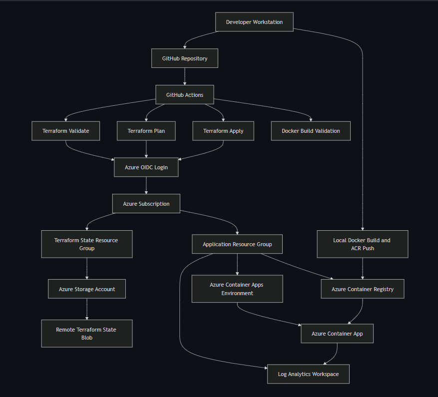
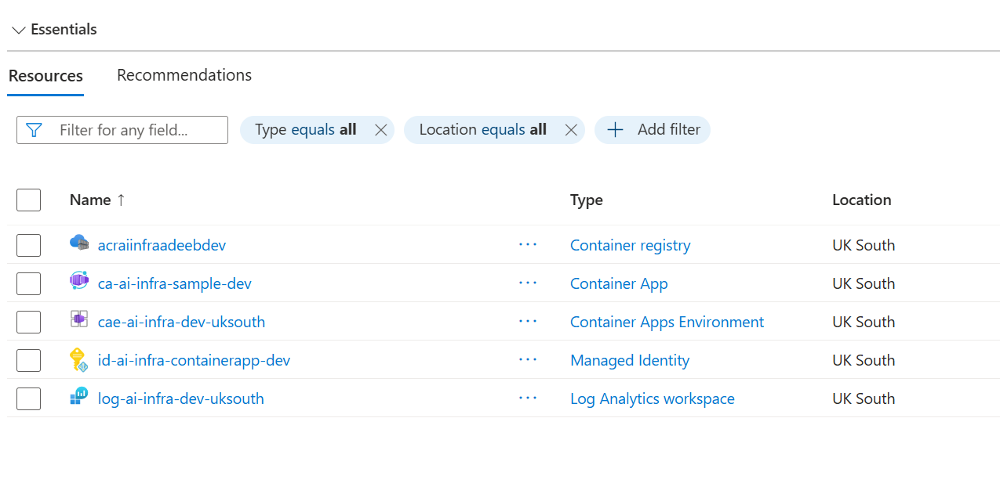
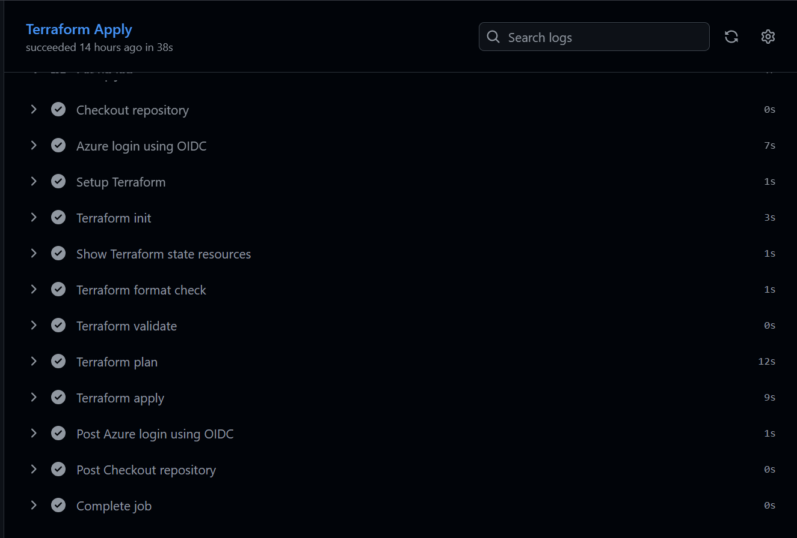

# Azure Cloud-Native Infrastructure Platform

> Repository: azure-ai-infra-platform
>
> This repository is structured as a multi-level platform engineering project. Level 1 establishes the cloud infrastructure foundation. Later levels introduce observability and AI infrastructure capabilities.

## Overview

This project demonstrates the design, provisioning, deployment, and operation of a cloud-native infrastructure platform on Microsoft Azure.

The primary objective is not application development. Instead, the focus is on building a realistic platform engineering environment using Infrastructure as Code, secure authentication, containerized workloads, CI/CD automation, remote state management, and operational documentation.

The platform is intentionally designed to resemble the practices used by modern cloud and platform engineering teams, prioritizing security, maintainability, automation, and operational readiness over the number of technologies used.

---

## Objectives

The project was built to demonstrate practical experience with:

* Infrastructure as Code using Terraform
* Cloud resource provisioning on Azure
* Remote Terraform state management
* Containerized application deployment
* Azure Container Registry
* Azure Container Apps
* GitHub Actions CI/CD pipelines
* OpenID Connect (OIDC) authentication
* Azure role-based access control (RBAC)
* Operational documentation and runbooks
* Basic platform observability

---

## Architecture

The platform follows a GitOps-inspired workflow:

Developer → GitHub Repository → GitHub Actions → Terraform → Azure

Infrastructure changes are version-controlled in Git, validated through GitHub Actions, and deployed to Azure using Terraform.

Key components include:

* Azure Resource Groups
* Azure Storage Account (Terraform Backend)
* Azure Container Registry (ACR)
* Azure Container Apps
* Azure Log Analytics Workspace
* GitHub Actions Workflows
* Azure OIDC Authentication

Detailed architecture documentation is available in:

```text
docs/architecture.md
```

---

---

## Platform Screenshots

### Architecture Diagram



The platform is provisioned and managed using Terraform, GitHub Actions, Azure Container Apps, Azure Container Registry, remote Terraform state, and OIDC-based authentication.

---

### Azure Infrastructure



The resource group contains the platform resources deployed through Terraform, including Azure Container Apps, Azure Container Registry, Log Analytics, and supporting infrastructure.

---

### Infrastructure Deployment



Infrastructure changes are deployed through GitHub Actions using Terraform and authenticated through Azure OpenID Connect (OIDC).

---

### Operational Visibility


Application and platform logs are collected in Azure Log Analytics and queried using Kusto Query Language (KQL).

---

### Remote Terraform State


Terraform state is stored remotely in Azure Blob Storage, enabling consistent state management across local development and CI/CD environments.

## Technology Stack

### Cloud

* Microsoft Azure
* Azure Container Apps
* Azure Container Registry
* Azure Storage Account
* Azure Log Analytics

### Infrastructure as Code

* Terraform

### Containers

* Docker

### CI/CD

* GitHub Actions

### Authentication & Security

* OpenID Connect (OIDC)
* Microsoft Entra ID
* Azure RBAC

### Operating Environment

* WSL2
* Linux CLI
* Git

---

## Repository Structure

```text
.
├── app/
│   ├── app.py
│   ├── Dockerfile
│   ├── requirements.txt
│   └── .dockerignore
│
├── infra/
│   └── terraform/
│       ├── main.tf
│       ├── variables.tf
│       └── outputs.tf
│
├── docs/
│   ├── architecture.md
│   └── runbook.md
│
└── .github/
    └── workflows/
        ├── terraform-validate.yml
        ├── terraform-plan.yml
        ├── terraform-apply.yml
        ├── docker-build.yml
        └── azure-login-test.yml
```

---

## Key Design Decisions

### Azure Container Apps Instead of AKS

The platform uses Azure Container Apps rather than Azure Kubernetes Service (AKS).

For the current scope, the objective is to demonstrate infrastructure provisioning, CI/CD automation, secure authentication, and container deployment rather than Kubernetes cluster operations.

Azure Container Apps provides a managed container platform while significantly reducing operational complexity.

### Remote Terraform State

Terraform state is stored in Azure Blob Storage rather than locally.

This approach enables:

* Shared infrastructure state
* CI/CD compatibility
* Reduced risk of state drift
* Improved operational reliability

### OIDC Instead of Client Secrets

GitHub Actions authenticates to Azure using OpenID Connect.

This removes the need for long-lived Azure credentials in GitHub and aligns with modern cloud security practices.

### Manual Infrastructure Changes

Terraform Apply is intentionally configured as a controlled operation.

Infrastructure changes should be reviewed before being applied, reducing the risk of unintended modifications to cloud resources.

---

## CI/CD Workflows

The repository includes several GitHub Actions workflows.

### Terraform Validate

Validates Terraform configuration and formatting.

### Terraform Plan

Generates an execution plan and verifies intended infrastructure changes.

### Terraform Apply

Applies approved infrastructure changes to Azure.

### Docker Build

Verifies successful container image builds.

### Azure Login Test

Validates GitHub OIDC authentication with Azure.

---

## Operational Documentation

The project includes operational documentation to support deployment, troubleshooting, and maintenance.

### Architecture Documentation

```text
docs/architecture.md
```

Contains:

* Platform architecture
* Component descriptions
* Design decisions
* Architectural tradeoffs

### Runbook

```text
docs/runbook.md
```

Contains:

* Deployment procedures
* Verification procedures
* Troubleshooting guidance
* Rollback guidance
* Operational checks

---

## Security Considerations

Security was treated as a first-class concern throughout the project.

Implemented controls include:

* OIDC authentication for GitHub Actions
* Azure RBAC authorization
* Remote Terraform state
* Separation of Terraform backend resources
* Elimination of long-lived Azure credentials from CI/CD workflows

The project intentionally favors secure operational practices over convenience.

---

## Operational Readiness

The platform supports:

* Infrastructure recreation through Terraform
* Automated validation through CI/CD
* Remote state management
* Containerized deployments
* Centralized logging
* Documented operational procedures

The goal is to ensure that the environment can be deployed, maintained, and handed over in a predictable manner.

---

## Lessons Learned

Building this platform provided practical experience with:

* Terraform state management
* Azure resource provisioning
* CI/CD pipeline design
* OIDC authentication flows
* Azure RBAC troubleshooting
* Container image lifecycle management
* Cloud infrastructure operations
* Infrastructure documentation practices

Particular emphasis was placed on understanding why production environments require remote state, identity-based authentication, automation, and operational documentation.

---

## Project Status

Level 1 is complete.

The platform successfully demonstrates a cloud-native infrastructure foundation using Azure, Terraform, Docker, GitHub Actions, remote state management, secure authentication, and operational documentation.

Further enhancements will be developed as separate project levels to preserve clarity, maintainability, and architectural focus.

